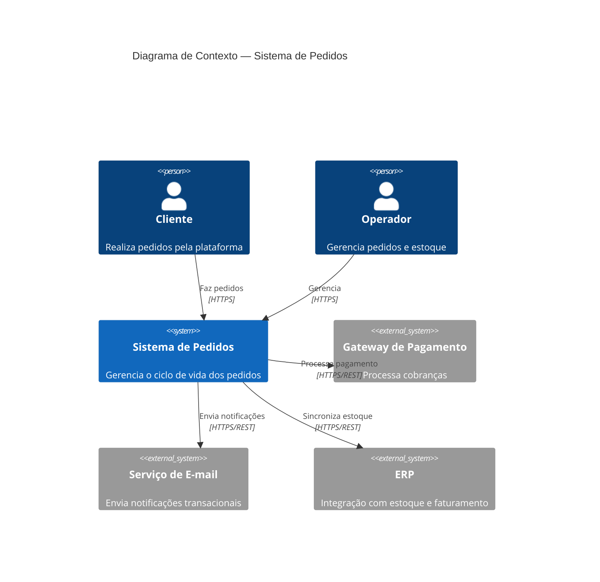
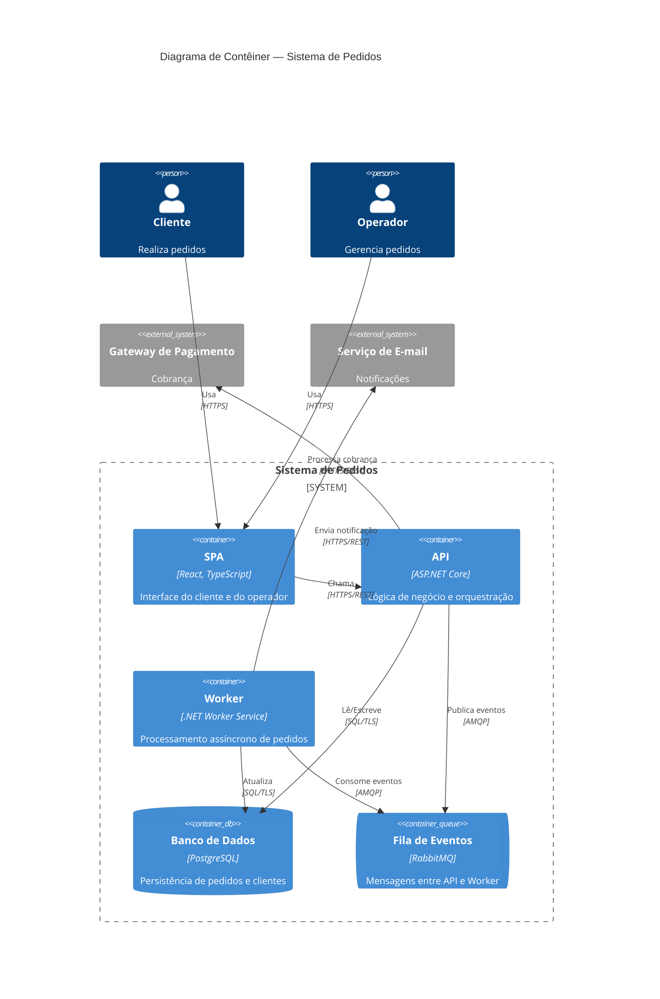
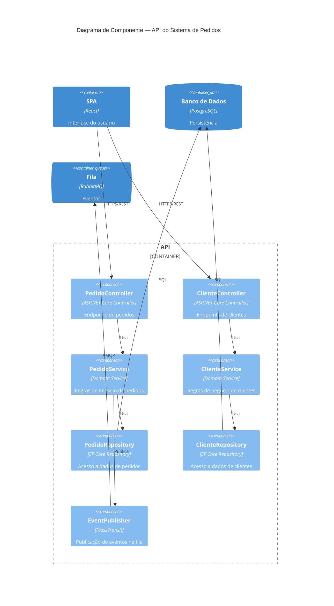
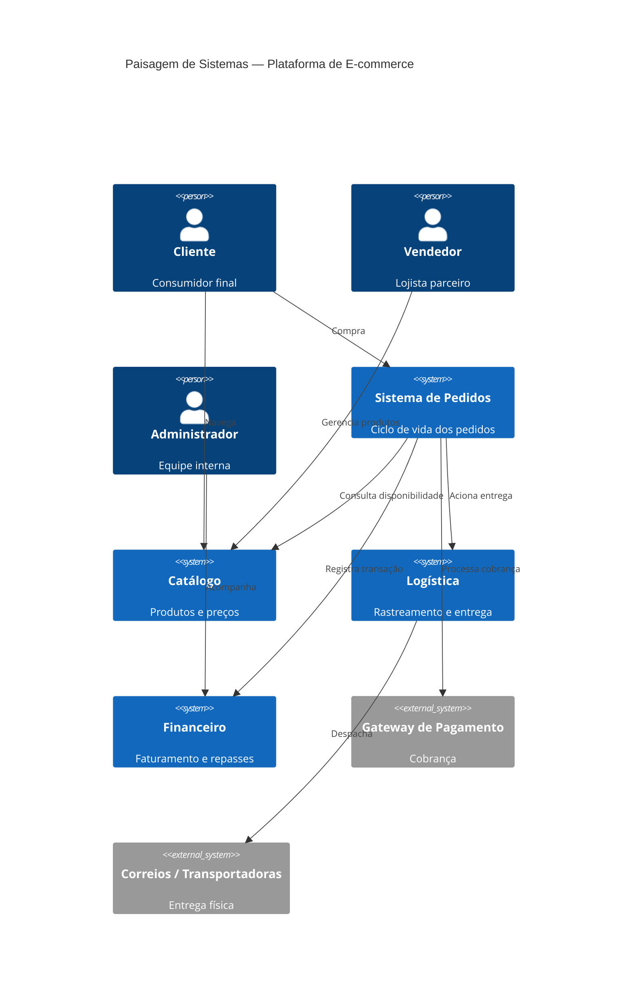
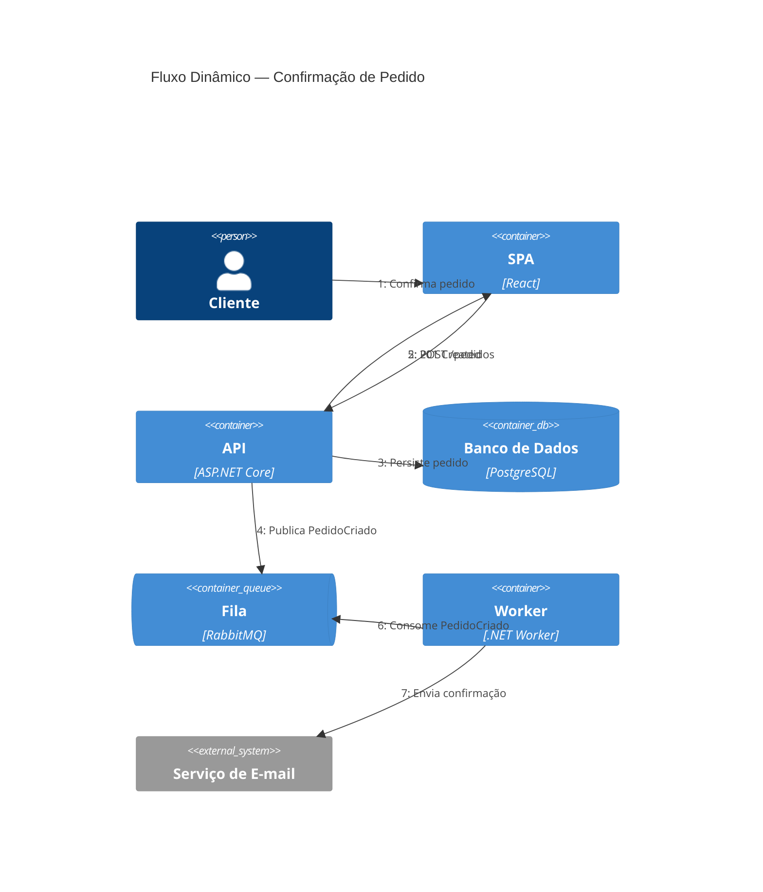
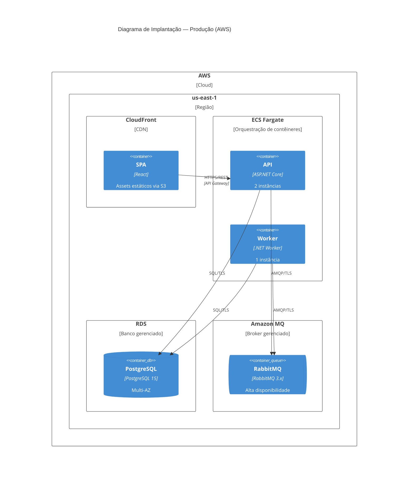

# Designer de Arquitetura C4Model

Atua como arquiteto de software e produz diagramas C4Model usando sintaxe Mermaid para documentar a solução em construção. Segue a metodologia de Simon Brown (https://c4model.com), aplicando o nível de abstração adequado a cada diagrama.

> **Posição no fluxo:** esta skill atua na parte do arquiteto da **etapa 3 (projeção paralela)** — especificação da **solução** em `SOLUTION.md`. A etapa 3 é colaborativa: `SOLUTION.md`, `ARCHITECTURE.md` e `GUIDELINE.md` são elaborados em conjunto por arquiteto e designer. O pré-requisito para entrar nessa etapa é `BUSINESS.md` (etapa 2) consolidado. Diagramas aqui produzidos se coordenam com `ARCHITECTURE.md` e, quando houver impacto em marca/UX, com `GUIDELINE.md`.

## Modo de Operação

Ao ser invocado, siga este protocolo antes de produzir qualquer diagrama:

1. **Verificar pré-requisito** — leia `docs/BUSINESS.md`. Se estiver ausente ou no estado de template vazio, **interrompa** e oriente o usuário a consolidar a etapa 2 antes de qualquer diagrama de solução. `GUIDELINE.md` é produzido em paralelo na mesma etapa 3, então leia-o se já existir para coordenar decisões, mas sua ausência não bloqueia o início da projeção da solução.

2. **Elicitar contexto** — se não fornecido, pergunte:
   - Nome e propósito do sistema em construção
   - Quem são os usuários (perfis e papéis)
   - Quais sistemas externos o sistema interage
   - Existe documentação prévia? (leia `docs/SOLUTION.md` se existir)

3. **Seguir a hierarquia** — sempre comece pelo nível mais alto e aprofunde conforme solicitado:
   - Contexto → Contêiner → Componente → Código (núcleo)
   - Landscape, Dynamic, Deployment (suplementares, conforme necessidade)

4. **Nunca misturar níveis** — cada diagrama representa um único nível de abstração.

5. **Incorporar cada diagrama inline em `docs/SOLUTION.md`**, na seção ou subseção em que o assunto ilustrado é tratado — o diagrama é parte da narrativa, não um anexo:
   - Diagrama de **Contexto** → junto à visão geral do sistema.
   - Diagrama de **Contêiner** → abrindo (ou dentro de) a seção que apresenta a decomposição estrutural do sistema.
   - Diagrama de **Componente** → dentro da subseção do contêiner decomposto.
   - Diagrama **Dinâmico** → junto à descrição do fluxo que ele ilustra.
   - Diagramas suplementares (**Landscape**, **Deployment**, dinâmicos auxiliares) que não correspondem a um assunto dedicado em `docs/SOLUTION.md` são a **exceção**: salve em `docs/solution/{nivel}-{nome}.md` e referencie em uma seção curta "Diagramas complementares" ao final de `docs/SOLUTION.md`. Padrões de nome para o caso de exceção: `context-{sistema}.md`, `container-{sistema}.md`, `component-{conteiner}.md`, `landscape.md`, `dynamic-{fluxo}.md`, `deployment-{ambiente}.md`.
   - Não crie uma seção dedicada "Diagramas" para abrigar os diagramas padrão — eles devem estar distribuídos contextualmente ao longo do documento.

6. **Ao concluir**, revise `docs/SOLUTION.md` para garantir que cada diagrama inline segue imediatamente a prosa do tema que ilustra, com notas complementares curtas (quando fizer sentido) em parágrafos regulares abaixo do bloco Mermaid.

---

## Glossário C4Model

| Elemento | Definição |
|---|---|
| **Person** | Ator humano que interage com o sistema (interno ou externo) |
| **Software System** | O sistema em análise ou um sistema externo com o qual ele se relaciona |
| **Container** | Unidade implantável independente: aplicação web, API, banco de dados, fila de mensagens, app mobile, job batch. **Não é Docker** — é qualquer processo ou armazenamento que roda de forma independente |
| **Component** | Agrupamento lógico de funcionalidades dentro de um contêiner: módulo, camada, serviço interno, controller, repositório |
| **Code / Class** | Artefato de código individual: classe, função, interface. Raramente diagramado — prefira visualização em IDEs |

Variantes de elementos externos: `Person_Ext`, `System_Ext`, `SystemDb_Ext`, `SystemQueue_Ext` — usados para elementos fora do limite do sistema em escopo.

---

## Diagramas Núcleo (4 Níveis)

### Nível 1: Contexto do Sistema — OBRIGATÓRIO

Mostra o sistema como uma caixa preta dentro do seu ambiente: quem usa, com quais outros sistemas se comunica.

**Quando usar:** sempre. É o ponto de partida de qualquer documentação de solução.



### Nível 2: Contêiner — OBRIGATÓRIO para sistemas com múltiplas unidades implantáveis

Decompõe o sistema em contêineres, mostrando a pilha tecnológica e a comunicação entre eles.

**Quando usar:** sempre que o sistema tiver mais de uma unidade implantável.

**OBRIGATÓRIO:** especificar a tecnologia de cada contêiner.



### Nível 3: Componente — RECOMENDADO para contêineres complexos

Decompõe um contêiner em seus componentes internos. Produzir um diagrama por contêiner relevante.

**Quando usar:** contêineres com muitos módulos, ao integrar novos colaboradores, ao mapear dívida técnica.



### Nível 4: Código — USO RARO

Representa classes, interfaces e suas relações para explicar padrões de implementação complexos.

**Quando usar:** apenas para padrões não óbvios que não ficam claros no nível de Componente. Prefira diagramas de classe UML.

---

## Diagramas Suplementares

### Paisagem do Sistema (System Landscape)

Visão panorâmica de múltiplos sistemas e suas relações. Útil para portefólios de produtos ou contextos corporativos com vários sistemas interdependentes.

**Não é um dos 4 níveis** — serve como mapa de navegação entre sistemas.



### Diagrama Dinâmico

Mostra como elementos interagem em tempo de execução para um fluxo específico. Equivale a um diagrama de sequência no nível C4.

**Quando usar:** para documentar fluxos críticos, casos de uso complexos ou comportamentos não óbvios a partir dos diagramas estáticos.



### Diagrama de Implantação

Mostra como os contêineres são distribuídos em nós de infraestrutura (servidores, regiões, ambientes de nuvem).

**Quando usar:** ao documentar requisitos de infraestrutura, ambientes (produção, staging), topologia de rede ou decisões de implantação.



---

## Referência Rápida — Elementos Mermaid por Diagrama

### C4Context e C4Container

| Elemento | Sintaxe | Descrição |
|---|---|---|
| Pessoa | `Person(id, "Nome", "Desc")` | Ator humano interno |
| Pessoa externa | `Person_Ext(id, "Nome", "Desc")` | Ator humano externo |
| Sistema | `System(id, "Nome", "Desc")` | Sistema em escopo |
| Sistema externo | `System_Ext(id, "Nome", "Desc")` | Sistema externo |
| Sistema (banco) | `SystemDb(id, "Nome", "Desc")` | Sistema representado como BD |
| Sistema (fila) | `SystemQueue(id, "Nome", "Desc")` | Sistema representado como fila |
| Limite de enterprise | `Enterprise_Boundary(id, "Nome")` | Agrupa elementos da organização |
| Limite de sistema | `System_Boundary(id, "Nome")` | Agrupa contêineres de um sistema |

### C4Container (elementos adicionais)

| Elemento | Sintaxe | Descrição |
|---|---|---|
| Contêiner | `Container(id, "Nome", "Tecnologia", "Desc")` | Unidade implantável |
| Contêiner (banco) | `ContainerDb(id, "Nome", "Tecnologia", "Desc")` | Banco de dados |
| Contêiner (fila) | `ContainerQueue(id, "Nome", "Tecnologia", "Desc")` | Fila de mensagens |
| Limite de contêiner | `Container_Boundary(id, "Nome")` | Agrupa componentes |

### C4Component (elementos adicionais)

| Elemento | Sintaxe | Descrição |
|---|---|---|
| Componente | `Component(id, "Nome", "Tecnologia", "Desc")` | Módulo interno |
| Componente (banco) | `ComponentDb(id, "Nome", "Tecnologia", "Desc")` | Banco de dados interno |
| Componente (fila) | `ComponentQueue(id, "Nome", "Tecnologia", "Desc")` | Fila interna |

### Relacionamentos

| Tipo | Sintaxe | Descrição |
|---|---|---|
| Direcional | `Rel(de, para, "Rótulo")` | Relação padrão |
| Direcional com protocolo | `Rel(de, para, "Rótulo", "Protocolo")` | Com protocolo explícito |
| Bidirecional | `BiRel(a, b, "Rótulo")` | Comunicação nos dois sentidos |
| Para cima | `Rel_U(de, para, "Rótulo")` | Direção forçada: cima |
| Para baixo | `Rel_D(de, para, "Rótulo")` | Direção forçada: baixo |
| Para esquerda | `Rel_L(de, para, "Rótulo")` | Direção forçada: esquerda |
| Para direita | `Rel_R(de, para, "Rótulo")` | Direção forçada: direita |
| Sequenciado | `RelIndex(n, de, para, "Rótulo")` | Apenas em C4Dynamic |

---

## Regras de Qualidade

**OBRIGATÓRIO:**
- Incluir `title` em todo diagrama
- Especificar tecnologia nos elementos de Contêiner e Componente
- Incluir protocolo nos relacionamentos de Contêiner (`"HTTPS/REST"`, `"AMQP"`, `"SQL/TLS"`)
- Usar `_Ext` para elementos externos ao sistema em escopo
- Máximo de 15-20 elementos por diagrama — se necessário, dividir em múltiplos diagramas

**PROIBIDO:**
- Misturar níveis de abstração no mesmo diagrama (ex: Person + Component)
- Omitir tecnologia em diagramas de Contêiner
- Usar rótulos de relacionamento ambíguos (`"chama"`, `"usa"`) sem especificar o protocolo em diagramas de Contêiner
- Criar Nível 4 (Código) salvo para padrões genuinamente complexos e não óbvios

---

## Workflow de Design

```
Invocação
    │
    ├─ Existe docs/SOLUTION.md com contexto? → Leia antes de perguntar
    │
    ▼
Elicitar (se necessário)
    ├─ Nome e propósito do sistema
    ├─ Usuários (perfis)
    └─ Sistemas externos
    │
    ▼
Nível 1: Contexto ──────────────────────────────── SEMPRE
    │
    ├─ Há múltiplas unidades implantáveis?
    │       ├─ Sim → Nível 2: Contêiner ────────── OBRIGATÓRIO
    │       │           │
    │       │           ├─ Algum contêiner é complexo?
    │       │           │       └─ Sim → Nível 3: Componente (por contêiner)
    │       │           │
    │       │           ├─ Há múltiplos sistemas no ecossistema?
    │       │           │       └─ Sim → Oferecer Landscape
    │       │           │
    │       │           ├─ Há fluxos de runtime críticos?
    │       │           │       └─ Sim → Oferecer Dynamic
    │       │           │
    │       │           └─ Há requisitos de infraestrutura?
    │       │                   └─ Sim → Oferecer Deployment
    │       │
    │       └─ Não → Documentar como sistema único no Contexto
    │
    ▼
Incorporar cada diagrama em docs/SOLUTION.md na seção em que o assunto é tratado;
salvar suplementares em docs/solution/ e referenciá-los em "Diagramas complementares"
```

---

## Referências

- **C4Model oficial**: https://c4model.com/
- **Sintaxe C4 Mermaid**: https://mermaid.js.org/syntax/c4.html
- **Editor online**: https://mermaid.live/
