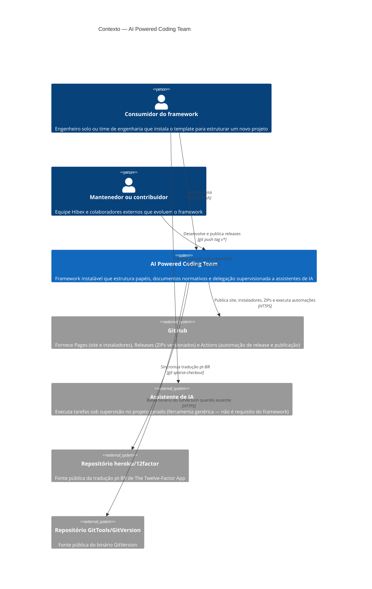
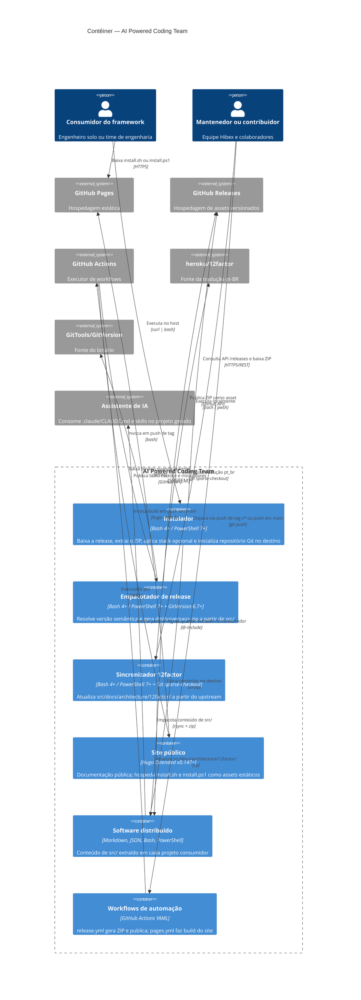
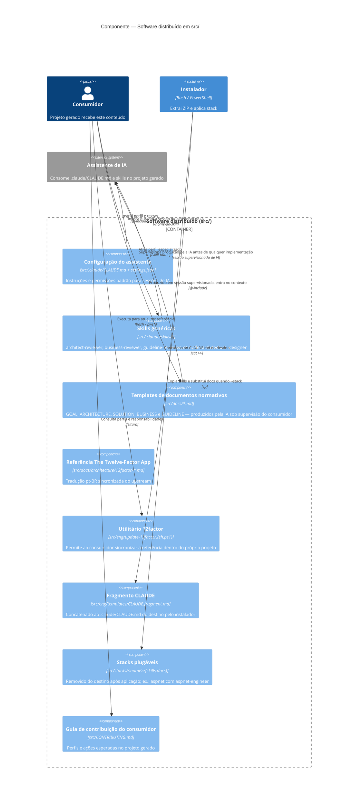
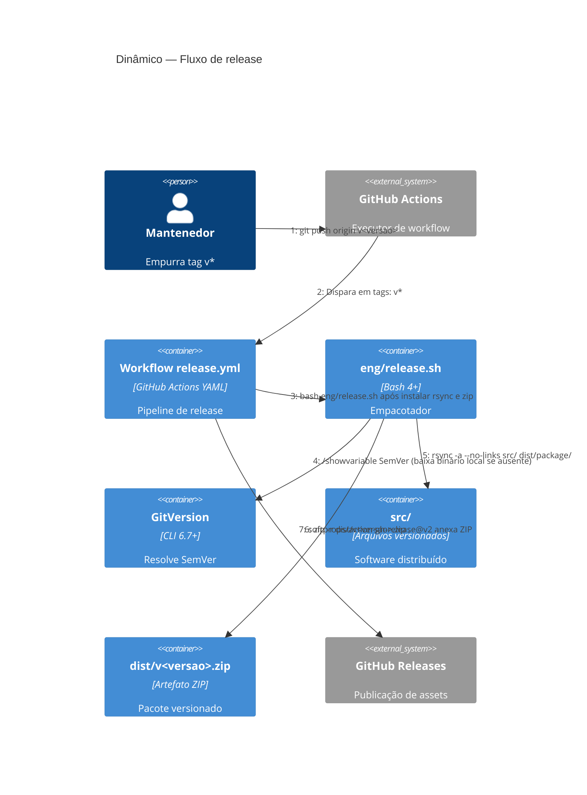
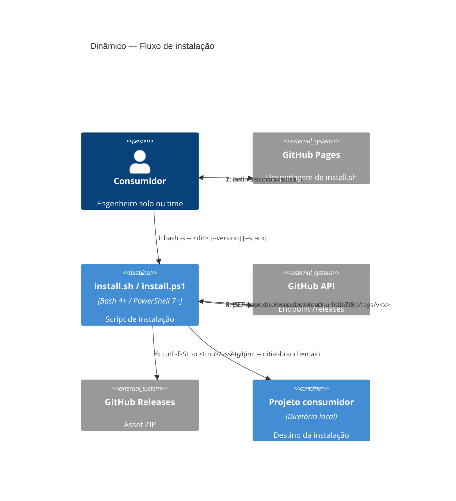

<!--
  Este arquivo é incluído no contexto do assistente de IA via diretiva @-include.
  Não use cabeçalhos H1 (#) nem H2 (##) — as seções devem iniciar em H3 (###).
-->

Este documento descreve a **solução técnica** para o problema e as regras de negócio especificadas em `BUSINESS.md`. Cada componente, tecnologia e fluxo aqui registrado responde a uma regra de `BUSINESS.md` (funcional ou não-funcional) ou a uma restrição de `ARCHITECTURE.md`.

A solução é projetada pelo **arquiteto** (em conjunto com o **designer** para os aspectos de marca e UX em `GUIDELINE.md`), tem `BUSINESS.md` como pré-requisito consolidado e serve de base para a implementação pelo **engenheiro**.

---

### Visão geral

O **AI Powered Coding Team** é um framework composto pelos seguintes componentes principais:

- **Software distribuído** (`src/`) — template que é extraído em cada projeto consumidor: configuração do assistente de IA, skills genéricas, stacks plugáveis, documentos normativos de referência e scripts utilitários.
- **Scripts de engenharia** (`eng/`) — instalador, empacotador de release e sincronizador da especificação *The Twelve-Factor App*.
- **Site público** (`docs/site/`) — documentação pública do framework, construída com Hugo Extended e publicada em GitHub Pages.
- **Pipelines de automação** (`.github/workflows/`) — workflows do GitHub Actions para release e para publicação do site.

O diagrama abaixo posiciona o framework como caixa preta dentro do seu ambiente, com os atores humanos e os sistemas externos dos quais depende.



- O framework é agnóstico à ferramenta de assistente de IA: a relação com "Assistente de IA" é ilustrativa e pode ser atendida por qualquer ferramenta compatível.
- GitHub é o único canal de distribuição (Pages + Releases) e o único executor de automação (Actions).
- As dependências em `heroku/12factor` e `GitTools/GitVersion` são apenas em tempo de manutenção — não afetam o projeto consumidor em *runtime*.

---

### Componentes

O diagrama a seguir decompõe o framework em suas unidades implantáveis/distribuíveis e mostra a pilha tecnológica de cada uma e a comunicação entre elas e os sistemas externos.



- **`payload` (software distribuído em `src/`)** não é um processo em execução — é um conjunto versionado de arquivos. É representado como contêiner porque é a unidade principal que o framework entrega e que tem ciclo de vida independente (release a release).
- Os scripts em `eng/` são representados como contêineres independentes (`installer`, `releaser`, `sync12f`) porque cada um tem responsabilidade isolada e é executado por atores distintos em contextos distintos.
- `GitHub Actions`, `GitHub Pages` e `GitHub Releases` são mostrados separadamente para explicitar quais funções do GitHub o framework consome — apesar de serem o mesmo provedor.
- Skills em `.claude/skills/` (raiz) não aparecem como contêiner: não são distribuídas e sua função é estritamente auxiliar ao mantenedor durante o desenvolvimento do framework.

#### Instalador

- Arquivos: `eng/install.sh`, `eng/install.ps1`.
- Responsabilidade: resolver a release alvo (última ou `--version <tag>`), baixar o ZIP do asset correspondente, extrair no diretório de destino, aplicar a stack opcional (`--stack <nome>`), mesclar o fragmento `eng/templates/CLAUDE.fragment.md` no `.claude/CLAUDE.md` do projeto instalado, inicializar um repositório Git em `main`.
- Dependências no host do consumidor: `git`, `curl`, `unzip` (equivalentes em PowerShell).

#### Empacotador de release

- Arquivos: `eng/release.sh`, `eng/release.ps1`.
- Responsabilidade: resolver a versão via GitVersion (baixando o binário para `.GitVersion.Tool/` quando não disponível no sistema, respeitando a versão mínima 6.7), copiar o conteúdo de `src/` para `dist/package/` via `rsync -a --no-links`, e gerar `dist/v<versao>.zip`.

#### Sincronizador *The Twelve-Factor App*

- Arquivos: `eng/update-12factor.sh`, `eng/update-12factor.ps1`, `src/eng/update-12factor.sh`, `src/eng/update-12factor.ps1`.
- Responsabilidade: *sparse-checkout* do repositório `heroku/12factor` e extração da tradução `pt_br` para `src/docs/architecture/12factor/` (na raiz) e para `docs/architecture/12factor/` (no projeto consumidor).
- Mantido em ambos os locais para permitir que tanto o mantenedor do framework quanto o consumidor atualizem a especificação referenciada.

#### Site público

- Gerador: **Hugo Extended** v0.147+.
- Localização do projeto Hugo: `docs/site/`.
- Conteúdo: `docs/site/content/` (`_index.md`, `instalacao.md`, `uso.md`, `boas-praticas.md`, `contribuindo.md`, `atualizacao-artefatos.md`).
- Templates: `docs/site/layouts/` (HTML com Go templates).
- Assets: `docs/site/static/` (CSS, JS, imagens; também hospeda os instaladores copiados pelo workflow).
- Publicação: GitHub Pages via `.github/workflows/pages.yml`, a cada *push* em `main`.
- Preview local: `hugo server --source docs/site`.
- O workflow de Pages copia `eng/install.sh` e `eng/install.ps1` para `docs/site/static/` antes do *build*, de modo que os instaladores fiquem acessíveis via `curl` nas URLs públicas do site.

#### Software distribuído em `src/`

Estrutura entregue a cada projeto consumidor:

- `src/.claude/` — `CLAUDE.md`, `settings.json` e `skills/` (skills genéricas).
- `src/docs/` — cinco documentos normativos como *templates* (produzidos pela IA sob supervisão do consumidor) e subdiretórios (`architecture/`, `solution/`, `business/`, `guideline/`).
- `src/docs/architecture/12factor/` — tradução `pt_br` de *The Twelve-Factor App*.
- `src/eng/` — `update-12factor.{sh,ps1}` e `templates/CLAUDE.fragment.md`.
- `src/stacks/<nome>/` — stacks plugáveis (*opt-in* via `--stack`).
- `src/CONTRIBUTING.md`, `src/CLAUDE.md`, `src/.gitignore`.

O diagrama a seguir decompõe o contêiner *Software distribuído* em seus componentes internos — o conteúdo que o framework entrega a cada projeto consumidor via ZIP de release.



- **`stacks`** é um componente *transitório* do payload: existe dentro do ZIP, mas o instalador o **remove do destino** após copiar o que interessa (skills e docs específicos). O diretório `stacks/` nunca aparece no projeto consumidor final.
- **`claude_frag`** é o único componente que não vai para o destino como arquivo próprio — seu conteúdo é concatenado ao final de `.claude/CLAUDE.md` do destino e o arquivo fonte permanece em `eng/templates/`.
- **`docs_12f`** reflete uma dependência versionada: a tradução pt-BR é sincronizada via `eng/update-12factor.*` (ver diagrama de contêiner). A versão embutida no ZIP é a que estava no repositório no momento do `release.sh`.
- A regra `RN-RELEASE-API-PUBLICA` (`src/**` é API pública) implica que qualquer renomeação ou remoção destes componentes exige incremento MAJOR de versão.

#### Skills genéricas (distribuídas)

Instaladas em todo projeto consumidor, independentemente da stack escolhida. Residem em `src/.claude/skills/`:

- `architect-reviewer` — valida conformidade com `docs/ARCHITECTURE.md` e com os doze fatores.
- `business-reviewer` — valida cobertura de regras em `docs/BUSINESS.md` pela implementação e pelos testes.
- `guideline-reviewer` — valida conformidade das interfaces com `docs/GUIDELINE.md`.
- `c4model-architectural-designer` — auxilia a produzir diagramas C4Model com sintaxe Mermaid em `docs/solution/`.

#### Skills de meta-uso (internas)

Residem em `.claude/skills/` (raiz) e são utilizadas apenas no desenvolvimento do próprio framework. Hoje são as mesmas quatro skills acima. Não são distribuídas ao consumidor — o instalador não as copia.

#### Stacks plugáveis

- Estrutura: `src/stacks/<nome>/{skills/, docs/}`.
- Stack atual: `aspnet`, com a skill `aspnet-engineer` e um `docs/SOLUTION.md` próprio que substitui o template vazio no momento da instalação.
- Contrato de stack: `docs/SOLUTION.md` é **obrigatório**; `docs/BUSINESS.md` e `docs/GUIDELINE.md` são opcionais e, quando presentes, também substituem os templates correspondentes no projeto instalado.

---

### Tecnologias adotadas

- **Bash** (POSIX com *bashisms* explícitos, Bash 4+) — scripts `.sh` em `eng/` e `src/eng/`.
- **PowerShell 7+** — scripts `.ps1` equivalentes para Windows e, opcionalmente, Linux/macOS.
- **Hugo Extended** v0.147+ — gerador do site público.
- **GitVersion** v6.7+ — cálculo automático de versão semântica.
- **GitHub Actions** — automação de release (`release.yml`) e de publicação do site (`pages.yml`).
- **GitHub Pages** — hospedagem do site público e dos assets de instalação.
- **GitHub Releases** — distribuição dos pacotes ZIP versionados.
- **Git sparse-checkout** — utilizado pelo sincronizador 12factor para trazer apenas o subdiretório `pt_br` do repositório `heroku/12factor`.
- **rsync**, **zip**, **unzip** — utilitários usados pelos scripts de empacotamento e instalação.
- **Markdown + diretivas `@`-include** — formato normativo de toda a documentação consumida pelo assistente de IA.
- **Mermaid** — sintaxe adotada para os diagramas C4Model.

---

### Canal de distribuição

O framework adota um **único canal de distribuição**: **GitHub Releases** para os artefatos ZIP versionados e **GitHub Pages** para o site público e a hospedagem dos assets `install.sh` e `install.ps1`. Essa decisão atende `RN-RELEASE-CANAL-UNICO` (canal único) e `RN-INSTALADOR-SEM-SEGREDO` (sem token/segredo no consumidor) — os assets são servidos pela API pública de Releases e pelo endpoint público de Pages.

- **Contrato de instalação**: `install.sh` via `curl | bash` (e `install.ps1` via PowerShell) deve permanecer *self-contained*, dependendo apenas de `git`, `curl` e `unzip` no host do consumidor (`RN-INSTALADOR-PREREQUISITOS`, `RN-SEM-RUNTIME-ADICIONAL`).
- **Automação do canal**: dois workflows do GitHub Actions cobrem a publicação:
  - `.github/workflows/release.yml` — gatilho em *tag* `v*`; invoca `eng/release.sh` e anexa o ZIP à GitHub Release.
  - `.github/workflows/pages.yml` — gatilho em *push* para `main`; faz o *build* do site Hugo e copia `eng/install.sh`/`install.ps1` para `docs/site/static/` antes de publicar em GitHub Pages.

---

### Versionamento

A versão do framework é resolvida automaticamente por **GitVersion** (v6.7+) a partir do histórico de commits e da *tag* mais recente no formato `v*`. O binário é localizado pelo `eng/release.sh`: utiliza o GitVersion do sistema se disponível; caso contrário baixa para `.GitVersion.Tool/` (fallback silencioso). Em ambiente CI, o binário é tipicamente baixado a cada execução.

A semântica SemVer aplicada a `src/**` (a API pública do framework, conforme `RN-RELEASE-API-PUBLICA`) é:

- **MAJOR** — remoções, renomeações ou mudanças comportamentais incompatíveis em `src/**`.
- **MINOR** — adições retrocompatíveis (nova skill genérica, nova stack, novo arquivo distribuído).
- **PATCH** — correções sem efeito em API (typos, ajustes internos).

**Implicação para o consumidor:** uma vez executado `install.sh` com uma versão específica, o projeto consumidor fica travado naquela versão até que o usuário decida reinstalar ou migrar. Mudanças futuras em `src/**` não afetam projetos já instalados — consequência direta da imutabilidade de releases (`RN-RELEASE-IMUTAVEL`) combinada à ausência de mecanismo de auto-atualização no canal.

---

### Fluxo de release

1. O mantenedor publica uma *tag* `v*` no repositório.
2. `.github/workflows/release.yml` é disparado.
3. Passos do workflow:
   - `actions/checkout@v4` com `fetch-depth: 0` (histórico completo, necessário para GitVersion).
   - Instalação de `rsync` e `zip`.
   - Execução de `bash eng/release.sh`, que:
     - Resolve GitVersion (sistema ou `.GitVersion.Tool/` local, respeitando a versão mínima).
     - Determina a versão via `gitversion /showvariable SemVer`.
     - Copia `src/` para `dist/package/` via `rsync -a --no-links`.
     - Gera `dist/v<versao>.zip` (excluindo `.DS_Store` e `Thumbs.db`).
   - Localiza o ZIP em `dist/v*.zip`.
   - `softprops/action-gh-release@v2` cria a GitHub Release e anexa o ZIP como asset.

O diagrama dinâmico abaixo materializa os passos acima — das regras de release em `docs/BUSINESS.md` — do `git push` da *tag* `v*` até o asset ZIP anexado à GitHub Release.



- **Imutabilidade (`RN-RELEASE-IMUTAVEL`)**: uma vez concluído o passo 7, o asset é final. Correções exigem nova *tag*.
- **Versionamento (`RN-RELEASE-VERSIONAMENTO-SEMVER`)**: o passo 4 é a fonte única de verdade sobre a versão. A *tag* apenas sinaliza o momento da release; a versão é determinada por GitVersion a partir do histórico.
- **Conteúdo do ZIP (`RN-RELEASE-ZIP-CONTEUDO`)**: o passo 5 copia exclusivamente `src/` — nenhum artefato da raiz entra no pacote.
- **GitVersion ausente**: o `release.sh` baixa o binário para `.GitVersion.Tool/` quando não encontra no `PATH` do sistema (fallback silencioso); em ambiente CI, geralmente o binário é baixado a cada execução.

### Fluxo de instalação

1. O consumidor executa, tipicamente:

   ```bash
   curl -fsSL https://hibex-solutions.github.io/ai-powered-coding-team/install.sh \
     | bash -s -- <diretório-destino> [--version v*] [--stack <nome>]
   ```

   (ou, no Windows, o equivalente em PowerShell via `install.ps1`).

2. O `install.sh` verifica os pré-requisitos (`git`, `curl`, `unzip`).
3. Consulta a API do GitHub (`/releases/latest` ou `/releases/tags/<v>`) para obter a URL do asset ZIP.
4. Baixa o ZIP para um diretório temporário e extrai no destino.
5. Se `--stack <nome>` foi informado, valida contra os subdiretórios de `stacks/`; caso inválido, remove o destino e falha com mensagem listando as stacks disponíveis.
6. Quando há stack válida: copia cada skill de `stacks/<stack>/skills/*` para `.claude/skills/`, substitui `docs/SOLUTION.md` pelo da stack e copia `BUSINESS.md`/`GUIDELINE.md` opcionais.
7. Remove o diretório `stacks/` do destino (é metadado de distribuição, não pertence ao projeto consumidor).
8. Concatena `eng/templates/CLAUDE.fragment.md` ao final de `.claude/CLAUDE.md` do projeto instalado.
9. Executa `git init --initial-branch=main` no destino.
10. Emite instruções finais ao usuário (configuração de `user.name`/`user.email` locais, primeiro commit, comando para iniciar a sessão do assistente de IA e ordem recomendada de produção supervisionada dos documentos).

O diagrama dinâmico abaixo materializa o fluxo acima — regras de instalação em `docs/BUSINESS.md` — do `curl | bash` até o `git init` no destino, passando pela aplicação opcional de stack.



- **Pré-requisitos (`RN-INSTALADOR-PREREQUISITOS`)**: antes do passo 3 o `install.sh` verifica presença de `git`, `curl` e `unzip` e falha com mensagem específica quando algum está ausente.
- **Stack inválida (`RN-INSTALADOR-STACK-INVALIDA`)**: entre os passos 7 e 8, se `--stack <nome>` foi informado e a stack não existe no pacote, o script remove o destino (`rm -r <dir>`) e sai com código não-zero listando as stacks disponíveis.
- **Agnosticismo da instalação (`RN-INSTALADOR-STACK-OPCIONAL`)**: sem `--stack`, o passo 7 apenas remove o diretório `stacks/` do destino; nenhum arquivo stack-específico é copiado.
- **Imutabilidade do destino**: o passo 9 deixa o diretório como repositório Git inicializado, sem commits — o consumidor é responsável pelo commit inicial e pela configuração local de `user.name`/`user.email`.

---

### Extensibilidade: mecanismo de stacks

Adicionar uma nova stack não requer alteração em nenhum script. Basta:

1. Criar `src/stacks/<nome>/skills/<nome>-engineer/SKILL.md` com a skill de engenheiro da stack.
2. Criar `src/stacks/<nome>/docs/SOLUTION.md` com o desenho de solução específico da stack (obrigatório).
3. Opcionalmente, criar `src/stacks/<nome>/docs/BUSINESS.md` e/ou `src/stacks/<nome>/docs/GUIDELINE.md`.
4. Registrar a skill de engenheiro na tabela de *Skills disponíveis* em `src/CONTRIBUTING.md`, com a marca `Somente se inicializado com --stack <nome>`.

O instalador descobre as stacks dinamicamente a partir dos subdiretórios de `stacks/` no pacote extraído.

---

### Diagramas complementares

Não há diagramas complementares neste momento. Quando houver (tipicamente *Landscape*, *Deployment* ou dinâmicos auxiliares que não correspondam a um assunto dedicado neste documento), residirão em `docs/solution/` e serão referenciados aqui.

#### Níveis deliberadamente não produzidos

- **Nível 4 (Código)** — não se aplica no escopo atual. O framework não tem padrões de código não óbvios que pedissem UML de classes; scripts em `eng/` são procedurais e o payload em `src/` é conteúdo normativo.
- **Landscape** — não se aplica. O framework é um sistema único; não há portefólio de sistemas interdependentes a mapear.
- **Deployment** — não se aplica. Toda a "implantação" se resume a GitHub Pages, GitHub Releases e GitHub Actions, já representados no diagrama de Containers como sistemas externos.
